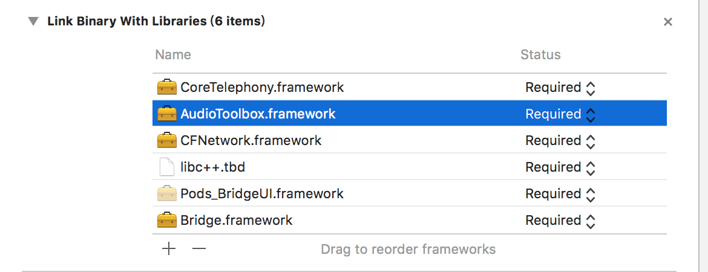
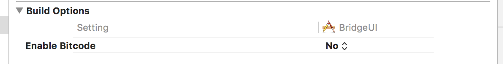

# Connector IOS SDK 说明文档

### 1. 接入必读
* 及时关注最新SDK发布
* 智能网关[设备指示灯状态](Other/PilotLight_CN.md)

### 2. 简介
本文档用于说明Connecotor开放平台SDK iOS版本接口之间的关系及接口调用顺序,对开放平台SDK iOS版本主要流程都有详细说明和代码示例。主要有名称解释、项目环境、权限配置和主要流程介绍。

### 3. 名称解释
| 名词 | 说明 |
| ------ |-------|
| 智能网关 |  | 
| 双向电机 |  |
| 单向电机 |  |
| WiFi电机 |  |
| 场景 |  |
| 定时器 |  |
| [成品帘类型](CurtainType/CurtainType_CN.md) |  |
| [设备数据点](DataPoint/DataPoint_CN.md) |  |

### 4. 项目环境配置
* 创建新的XCode工程，然后导入Bridge.framework:
* 导入系统依赖库CFNetwork.framework,libc++.tbd,AudioToolbox.framework,CoreTelephony.framework,如下图所示

* 关闭目标Target的Bitcode功能 Build Settings->Enable Bitcode设置为NO。如下图所示

* 配置完成

### 5. 主要流程
##### 5.1 初始化流程
* 获取到项目AppId后,在AppDelegate中初始化SDK。参考代码 

```
-(BOOL)application:(UIApplication *)application didFinishLaunchingWithOptions:(NSDictionary *)launchOptions{
    // Override point for customization after application launch.
    [self configKeyboardManager];
    [BridgeSDK initLibWithAppId:AppId];
 }
```

##### 5.2 网关、WiFi设备配网配网流程
* 将[网关](Class/HomeInfo_CN.md)或WiFi[设备](Class/DeviceInfo_CN.md)处于配网状态
* 手机连上[网关](Class/HomeInfo_CN.md)或WiFi[设备](Class/DeviceInfo_CN.md) AP热点
* 调用[网关](Class/HomeInfo_CN.md)或WiFi[设备](Class/DeviceInfo_CN.md)配网API，将[网关](Class/HomeInfo_CN.md)或WiFi[设备](Class/DeviceInfo_CN.md)配网添加到系统中。参考代码

```
[HubInfo configNetWorkWithWifiSSID:Your Network WiFi SSID
                          password:WiFi Passord
                           timeOut:60
                           hubType:@"02000001"
                        completion:^(NSError *error, id responsobject) {
                            if(error == nil){
                                NSInteger retCode = [responsobject[@"retCode"] integerValue];
                                if (retCode == BRIDGE_OPERATION_SUCCESS) {
                                    HubInfo *hub = responsobject[@"device"];
                                    //config wifi success,goto bind,bind to room、home or zone
                                }else{
                                    //goto fail
                                }
                            }else{
                                //goto fail
                            }
                        }];        
```

```
[DeviceInfo configNetWorkWithWifiSSID:Your Network WiFi SSID
                             password:WiFi Passord
                              timeOut:60
                           deviceType:@"22000000"
                           completion:^(NSError *error, id responsobject) {
                               if(error == nil){
                                   NSInteger retCode = [responsobject[@"retCode"] integerValue];
                                   if (retCode == BRIDGE_OPERATION_SUCCESS) {
                                       DeviceInfo *device = responsobject[@"device"];
                                       //config wifi success,goto bind,bind to room、home or zone
                                   }else{
                                       //goto fail
                                   }
                               }else{
                                   //goto fail
                               }
                           }];
```

* 将上一步配网得到的[设备](Class/DeviceInfo_CN.md)或者[网关](Class/HomeInfo_CN.md)，绑定到指定Room或者Home下。参考方法

```
[hub bindHubToHomeWithHomeCode:homeCode
                    completion:^(NSError *error, id responsobject) {
                        dispatch_async(dispatch_get_main_queue(), ^{
                            if(error == nil){
                                NSInteger retCode = [responsobject[@"retCode"] integerValue];
                                if (retCode  == BRIDGE_OPERATION_SUCCESS) {
                                    //add hub success
                                }else{
                                    //goto fail
                                }
                            }
                        });
                    }];
                 
```

```
[device bindDeviceToRoomWithRoomCode:roomCode
                          completion:^(NSError *error, id responsobject) {
                              dispatch_async(dispatch_get_main_queue(), ^{
                                  if(error == nil){
                                      NSInteger retCode = [responsobject[@"retCode"] integerValue];
                                      if (retCode  == BRIDGE_OPERATION_SUCCESS) {
                                          //add device success
                                      }else{
                                          //goto fail
                                      }
                                  }
                              });
                          }];
```

* [网关](Class/HomeInfo_CN.md)或WiFi[设备](Class/DeviceInfo_CN.md)添加完成，接下来您可以给[网关](Class/HomeInfo_CN.md)或WiFi[设备](Class/DeviceInfo_CN.md)做些个性化设置，例如修改名称。


##### 5.3 单向、双向电机配对流程

* 第一步调用[网关类](Class/Class_CN)配对设备接口，成功直接返回[设备对象](Class/DeviceInfo_CN.md)。参考代码

```
[hub pairDeviceWithCurtainType:1
                    deviceType:@"10000000"
                    completion:^(NSError *error, id responsobject) {
                        if([responsobject[@"retCode"] integerValue] != BRIDGE_OPERATION_SUCCESS){
                            //goto fail
                        }else{
                            DeviceInfo* device = responsobject[@"device"];
                            //pair success, goto bind
                        }else{
                            //goto fail
                        }
                    }
 }];
```

* 第二步将配对成功的[设备](Class/DeviceInfo_CN.md)绑定到房间或者Home下，参考代码

```
[device bindDeviceToRoomWithRoomCode:roomCode
                          completion:^(NSError *error, id responsobject) {
                              dispatch_async(dispatch_get_main_queue(), ^{
                                  if(error == nil){
                                      NSInteger retCode = [responsobject[@"retCode"] integerValue];
                                      if (retCode  == BRIDGE_OPERATION_SUCCESS) {
                                          //add device success
                                      }else{
                                          //goto fail
                                      }
                                  }
                              });
                          }];
```
* [设备](Class/DeviceInfo_CN.md)添加完成，接下来您可以给[设备](Class/DeviceInfo_CN.md)做些个性化设置，例如修改名称。

##### 5.4 控制流程

* 第一步,根据[数据点文档](DataPoint/DataPoint_CN.md)，组设备控制命令。以双向电机为例,开、关、停止、调行程到50%、调角度到90°数据点分别为

```
//开
NSDictionary* data = [[NSDictionary alloc] initWithObjectsAndKeys:@(0),@"operation", nil];

```

```
//关
NSDictionary* data = [[NSDictionary alloc] initWithObjectsAndKeys:@(1),@"operation", nil];

```

```
//停止
NSDictionary* data = [[NSDictionary alloc] initWithObjectsAndKeys:@(2),@"operation", nil];

```

```
//调行程到50%
NSDictionary* data = [[NSDictionary alloc] initWithObjectsAndKeys:@(50),@"targetPosition", nil];

```

```
//调角度到90°
NSDictionary* data = [[NSDictionary alloc] initWithObjectsAndKeys:@(90),@"targetAngle", nil];

```

* 第二步,将上一步组好的数据点数据通过[设备](Class/DeviceInfo_CN.md)控制接口下发

```
[device controlDeviceWithData:data
                        completion:^(NSError *error, id responsobject) {
                            if(error == nil){
                                NSInteger retCode = [responsobject[@"retCode"] integerValue];
                                if (retCode != BRIDGE_OPERATION_SUCCESS) {
                                    //Control Success
                                }else{
                                    //Control Fail
                                }
                            }else{
                                //Control Fail
                            }
                        }];                        
```

* 第三步,设备数据点数据下发成功之后，设备会按照数据点设置运行，运行成功之后。设备会上报设备最新数据点数据信息。

##### 5.5 设备信息(属性或数据点)更新上报

[设备](Class/DeviceInfo_CN.md)的数据点或属性发生变化以后，SDK会通过[SDK管理类](Class/BridgeManager_CN.md)代理方法回调设备最新信息。方法为

```
- (void)deviceStatusChangeWithDeviceInfo:(DeviceInfo *)deviceInfo

```

### 6. API DOC
#####  6.1 [类族](Class/Class_CN.md)
#####  6.2 [错误码](ErrorCode/ErrorCode_CN.md)
#####  6.3 [其他常量](Constant/Constant_CN.md)

### 7. App下载
* [AppStore](https://itunes.apple.com/cn/app/connector/id1344058317?mt=8)


* [GooglePlay](https://play.google.com/store/apps/details?id=com.smarthome.app.connector)


### 8. 技术支持
* 邮件: <smarthome.app.developer@gmail.com>
* Skype: <549819728@qq.com>
* 微信: wt_870529
